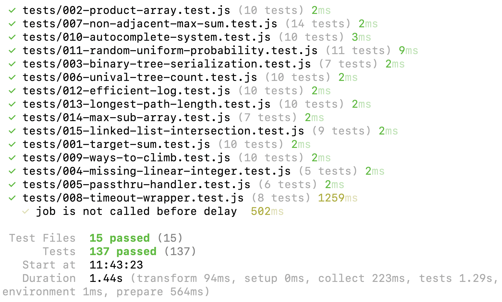

# Coding Challenges

My collection of (almost daily) coding challenges, algorithmic problems, and data structure exercises.


## Project Structure

- `solutions/` - Problem descriptions and implementations.
- `tests/` – Tests to validate the solutions.
- `assets/` – Supporting files.

## Run Tests

```bash
npm i
npm test
```


